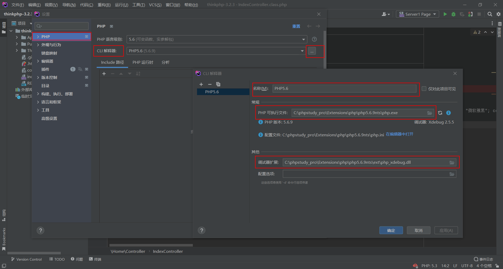
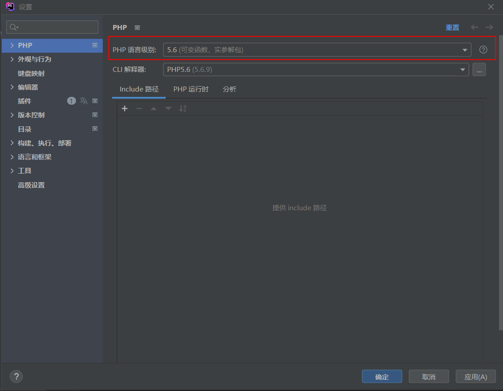
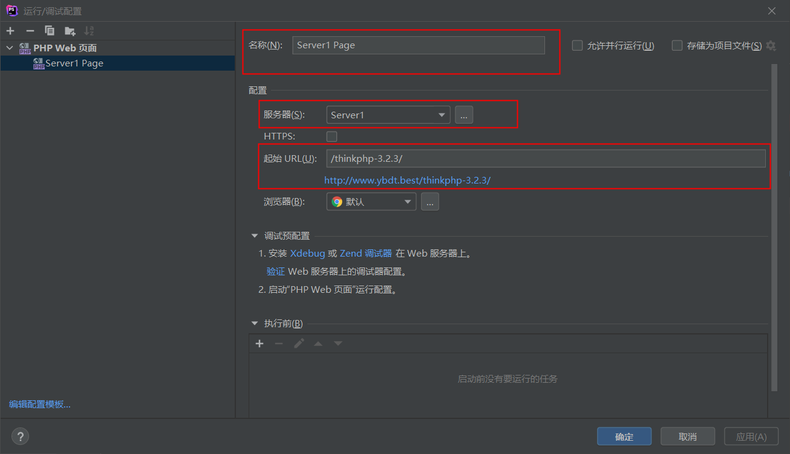
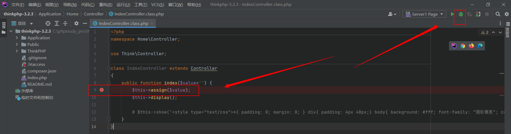
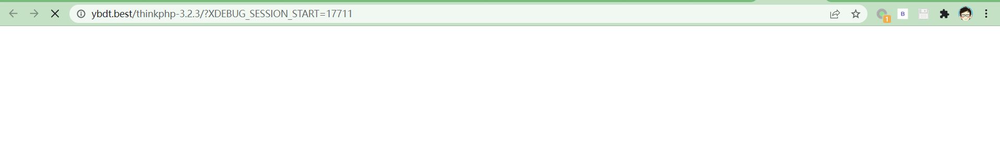

之前配置过基于phpstudy + vscode的php动态调试环境，不过在大型框架上用着效果不怎么好，还是得phpstorm，以往这种教程类文章我都是网上找一篇好文照着做然后本地备份一份，奈何搜了一圈没有好文，在此记录一下（耗时约3小时），方便自己也方便他人

本文定位教程类文章，共包括step1 - step7
# step1-修改php.ini
本文我们以php5.6为例，首先修改php5.6中的php.ini  
  
在末尾添加如下代码  
```
zend_extension="C:\phpstudy_pro\Extensions\php\php5.6.9nts\ext\php_xdebug.dll"
xdebug.remote_enable=1
xdebug.remote_host=localhost
xdebug.remote_port=9100
```
解释如下  
```
zend_extension="C:\phpstudy_pro\Extensions\php\php5.6.9nts\ext\php_xdebug.dll" #指定xdebug位置
xdebug.remote_enable=1 #开启远程调试（个人理解本地调试也是远程调试的一种，取决于监听地址）
xdebug.remote_host=localhost #指定远程调试监听地址
xdebug.remote_port=9100 #指定远程调试监听端口
```
结果如下  
  
修改后重启Web服务，可通过phpinfo查看是否修改成功  
  

# step2-配置xdebug
phpstudy中默认带有xdebug，无需额外下载，直接指定即可，设置方式如下  
文件->设置  
  
PHP->CLI解释器（点击右边包含3个点的按钮）->设置名称、PHP可执行文件、调试器扩展  
  
回到设置->PHP界面，顺便将PHP语言级别指定为：5.6（可变函数，实参解包），这样更对称一些  
  
PHP->调试->Xdebug，指定调试端口为之前设置的9100  
  

# step3-配置服务器
PHP->服务器->添加，指定名称、主机、端口（其中www.ybdt.best是我修改hosts后，指向127.0.0.1的域名）  
  

# step4-编辑配置
打开编辑配置，首次配置需要选择“PHP Web Page”  
  
在编辑配置中设置名称、服务器、起始URL  
  

# step5-调试测试
在第9行下断点，并点击右上角的甲壳虫  
  
PHPStorm会自动打开浏览器  
  
同时停在设置的断点处  
  

# step6-带参数的调试测试
有人可能会问，直接点击甲壳虫不能带有参数啊？  
其实首次发起请求后，Cookie中会带有XDEBUG_SESSION_START参数，再次发起请求后会自动走phpstorm的xdebug  
例如，发起如下请求  
  
phpstorm会停在断点，可看到用户传入的参数  
  

# step7-网关超时
停在断点处没几分钟，会出现网关超时的问题，解决办法  
```
在nginx配置文件的http块增加
fastcgi_read_timeout 3600s;
```

# 参考链接
https://jetbrains.com.zh.xy2401.com/help/phpstorm/creating-and-editing-run-debug-configurations.html  
https://segmentfault.com/a/1190000018961750  
https://blog.csdn.net/weixin_44155363/article/details/106950662  
https://cyc1e183.github.io/2019/07/15/Windows%E4%B8%8B-PHPstorm-Xdebug-%E5%8A%A8%E6%80%81%E8%B0%83%E8%AF%95%E7%8E%AF%E5%A2%83%E9%85%8D%E7%BD%AE/  
https://blog.csdn.net/weixin_37281289/article/details/106183050  