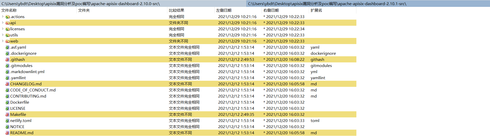
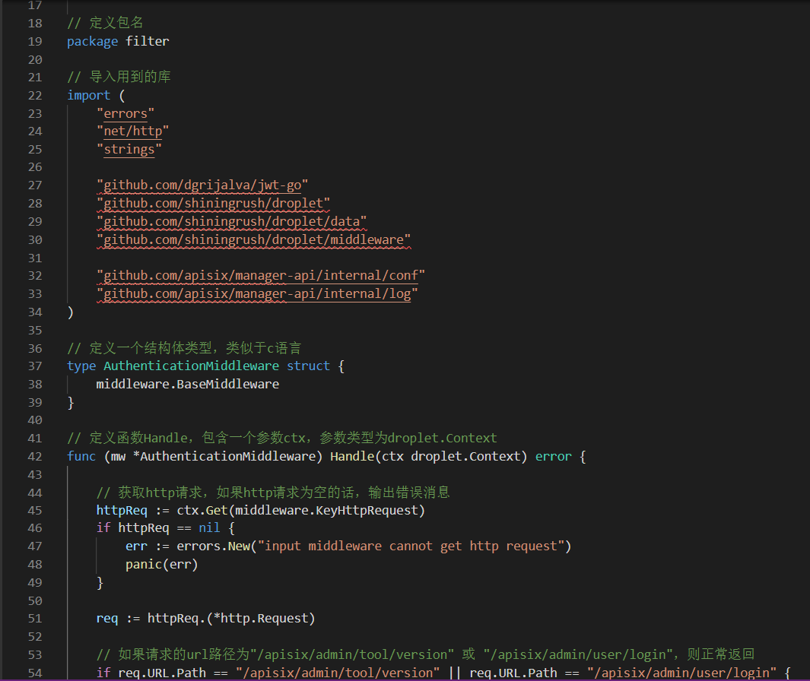
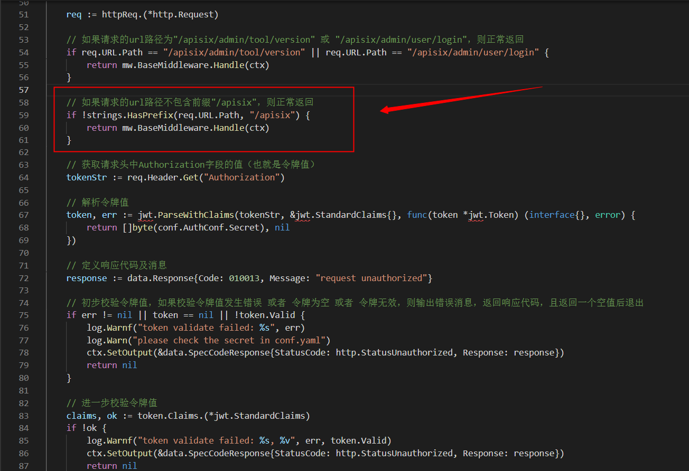

# 0x01-漏洞原理
在2.10.1之前的Apache APISIX Dashboard中，Manager API使用了两个框架，并在框架‘gin’的基础上引入了框架‘droplet’，所有的API和认证中间件都是基于框架‘droplet’开发的，但有些API直接使用框架‘gin’的接口，从而绕过了认证。

参考链接：https://mp.weixin.qq.com/s/vUmFcD3vV7l_RWfO9pzQRw

其中/apisix/admin/migrate/export和/apisix/admin/migrate/import就是直接使用框架‘gin’的接口，可以未授权访问  
参考链接：  
根据网上公开poc  

配合Apache Six的配置中支持Script功能（即执行lua代码），最终导致攻击者可以先导出配置，再导入带有script功能的配置，执行lua代码
参考链接：
https://apisix.apache.org/docs/apisix/architecture-design/script/
# 0x02-漏洞细节
根据官方通告https://apisix.apache.org/zh/blog/2021/12/28/dashboard-cve-2021-45232/得知：受影响版本为Apache APISIX Dashboard 2.7 - 2.10
不受影响版本为Apache APISIX Dashboard 2.10.1 及以上版本

下载apache-apisix-dashboard-2.10.0-src.tgz和apache-apisix-dashboard-2.10.1-src.tgz
下载地址：http://archive.apache.org/dist/apisix/dashboard/2.10.0/

diff一下代码
  
展开后依次翻阅
  
最终定位到文件authentication.go，如下图
  
如下是2.10.0版本下authentication.go的代码，注释中包含对每个函数、每条语句的解释，2.10.1版本下authentication.go的逻辑和2.10.0版本基本相同
  
  
  
阅读上述代码，可发现作者没有做足够的限制