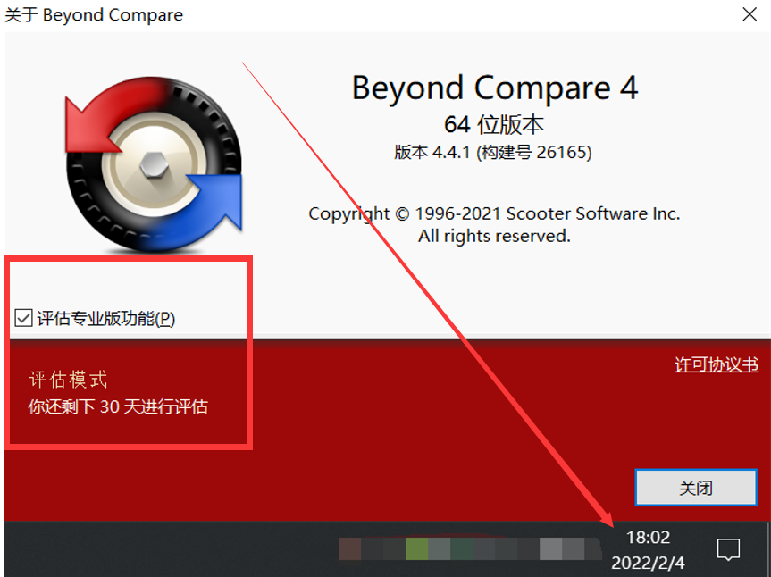
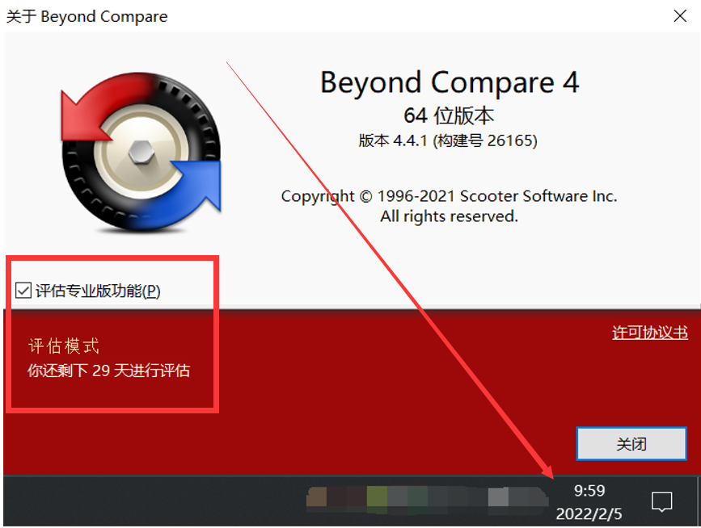

# 前言
Beyond Compare是一款商业级别代码比对工具，30天试用后需要付费，功能很强大，故我们来试着白嫖它

# 0x01-结论
删除指定注册表项下的值项可重新试用30天

# 0x02-过程
2022/02/04日打开后，显示剩余30天评估，如下图  
  
2022/02/05日打开后，显示剩余29天评估，如下图  
  
执行完批处理后，显示剩余30天评估，如下图  
  

# 0x03-结果
```
chcp 65001

rem 参考链接：https://gist.github.com/rise-worlds/5a5917780663aada8028f96b15057a67
rem 参考链接：https://blog.csdn.net/qq_23958061/article/details/119377576

reg.exe delete "HKEY_CURRENT_USER\SOFTWARE\Scooter Software\Beyond Compare 4" /v CacheID /f

pause
```
将上述批处理加到任务计划程序，每月1号定期执行，并设置“过了计划开始时间，立即执行”