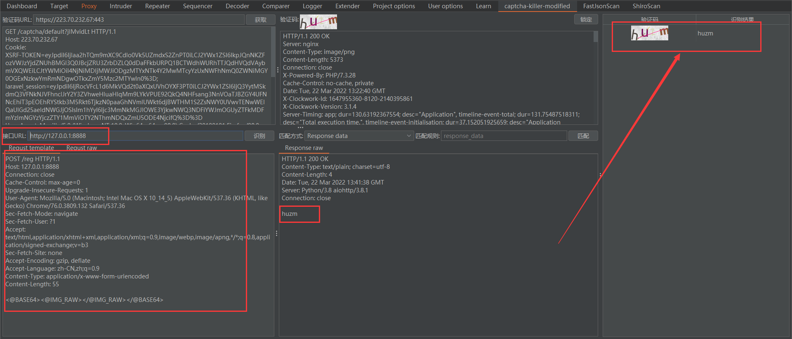
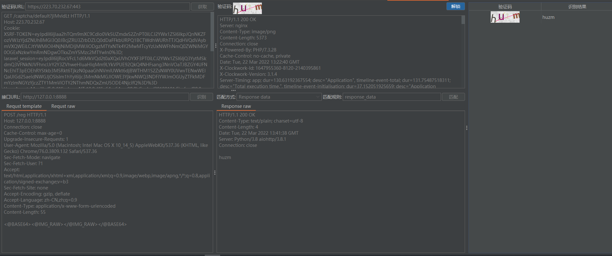
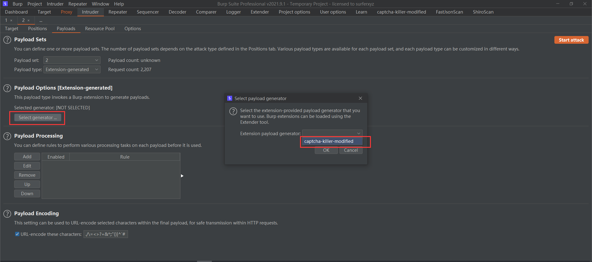
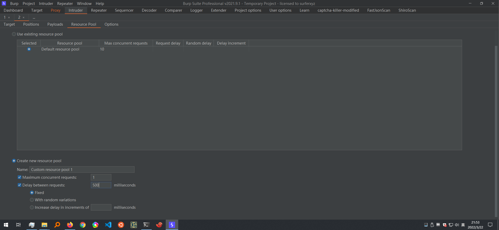

# 吐槽
逛github看到一个项目，讲述如何爆破带有验证码的Web登录表单，作者是基于c0ny1师傅的captcha-killer项目修改了一下，过程叙述稍微有点简陋，自己折腾了好一会，想想还是记录下使用过程，方便自己也方便他人（耗时约3小时）

本文定位教程类文章，共包括step1 - step5
# step1-安装插件
下载并安装插件  
下载地址：https://github.com/f0ng/captcha-killer-modified/releases  

# step2-插件获取图片验证码
burp抓包会发现某个请求是获取图片验证码的，将这个请求发送到插件中的captcha panel
  
点击captcha-killer-modified界面中的获取，发现可以正常获取验证码  
  

# step3-本地启动验证码识别接口
此处我们使用github上的一个开源验证码识别项目，没有次数限制，识别率在80%左右
```
pip3.exe install ddddocr

python3.exe .\codereg.py
```
codereg.py位于：https://github.com/f0ng/captcha-killer-modified/blob/main/codereg.py  
  


# step4-识别验证码
点击captcha-killer-modified界面，接口URL填写启动后监听的地址
```
http://127.0.0.1:8888
```
请求模板填如下
```
POST /reg HTTP/1.1
Host: 127.0.0.1:8888
Connection: close
Cache-Control: max-age=0
Upgrade-Insecure-Requests: 1
User-Agent: Mozilla/5.0 (Macintosh; Intel Mac OS X 10_14_5) AppleWebKit/537.36 (KHTML, like Gecko) Chrome/76.0.3809.132 Safari/537.36
Sec-Fetch-Mode: navigate
Sec-Fetch-User: ?1
Accept: text/html,application/xhtml+xml,application/xml;q=0.9,image/webp,image/apng,*/*;q=0.8,application/signed-exchange;v=b3
Sec-Fetch-Site: none
Accept-Encoding: gzip, deflate
Accept-Language: zh-CN,zh;q=0.9
Content-Type: application/x-www-form-urlencoded
Content-Length: 55

<@BASE64><@IMG_RAW></@IMG_RAW></@BASE64>
```
点击识别，可以看到能够识别到验证码  
  
点击锁定  
  

# step5-暴力破解
burp拦截登录数据包  
  
发送到intruder，选择Pitchfork  
  
payload1正常选择字典，payload2选择如下  
  
  
线程选择1，发送延时为500ms  
  
可看到能够成功爆破带有验证码的Web表单，识别率在80%左右  
  

# 参考链接
https://mp.weixin.qq.com/s/_P6OlL1xQaYSY1bvZJL4Uw  
https://github.com/f0ng/captcha-killer-modified  
https://github.com/c0ny1/captcha-killer  
https://gv7.me/articles/2019/burp-captcha-killer-usage/  
https://github.com/sml2h3/ddddocr  